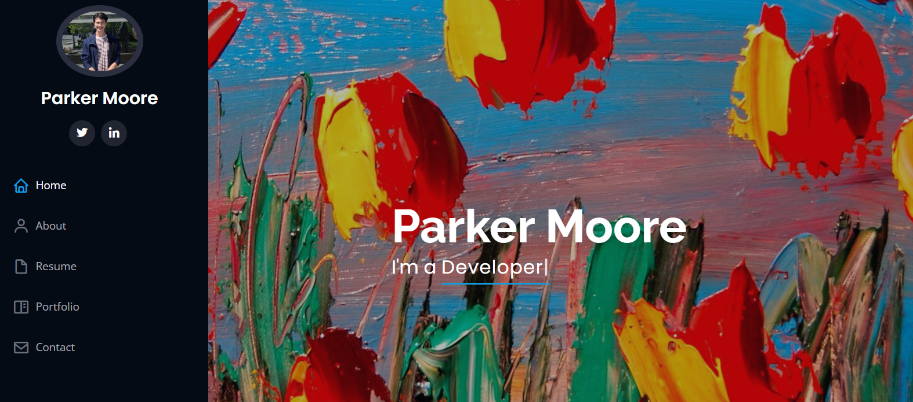

# Parker Moore's Portfolio Website

## About the Developer

Hi, I'm Parker Moore, a passionate web developer with a strong focus on both back-end and front-end development. This portfolio website showcases my skills, projects, and experience. You can connect with me on [LinkedIn](https://www.linkedin.com/in/parkermoore317/), or check out my [Portfolio Project repository](https://github.com/cpmoore0317/cpmoore0317.github.io).

## Project Description

This portfolio website is designed to highlight my skills, showcase my projects, and provide information about my professional background. It is built with modern web technologies and aims to provide a seamless and engaging user experience. The website features an introduction about me, a portfolio section displaying my projects, a blog section for sharing my thoughts and experiences, and a contact form for getting in touch.

## Features

* **Responsive Design**: Ensuring the website is accessible and visually appealing on all devices.
* **Project Showcase**: Displaying detailed information about my projects with images and descriptions.
* **Blog**: Sharing insights, experiences, and tutorials related to web development.
* **Contact Form**: Allowing visitors to easily get in touch with me.
* **Modern Web Technologies**: Utilizing HTML, CSS, JavaScript, and various frameworks/libraries to build the website.

## Project Story

The development of this portfolio website began with the goal of creating an online presence to showcase my work and skills. Starting with a basic design, I gradually added more features and improved the layout to make it more interactive and user-friendly. Throughout the process, I encountered challenges such as ensuring cross-browser compatibility, optimizing performance, and creating a cohesive design. These challenges provided valuable learning experiences and helped improve the overall quality of the website.

### Implemented Features

* Responsive design for all devices
* Detailed project showcase
* Blog section for sharing content
* Functional contact form
* Smooth navigation and user experience

### Features to be Implemented

* Integration with a CMS for easier content management
* Adding more interactive elements and animations
* SEO optimization for better search engine ranking
* Implementing a dark mode option

### Challenges Encountered

Some of the main challenges included ensuring cross-browser compatibility, optimizing the website for performance, and creating a visually appealing yet functional design. Debugging JavaScript issues and ensuring responsive design across different devices also posed significant challenges. These obstacles, however, were instrumental in enhancing my problem-solving skills and the overall quality of the project.
